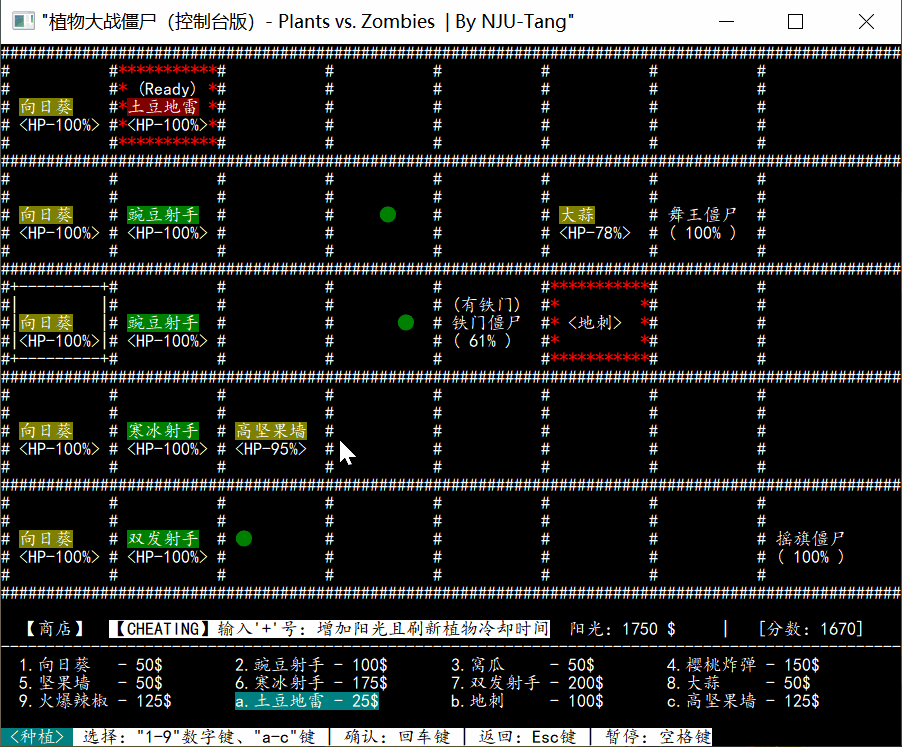
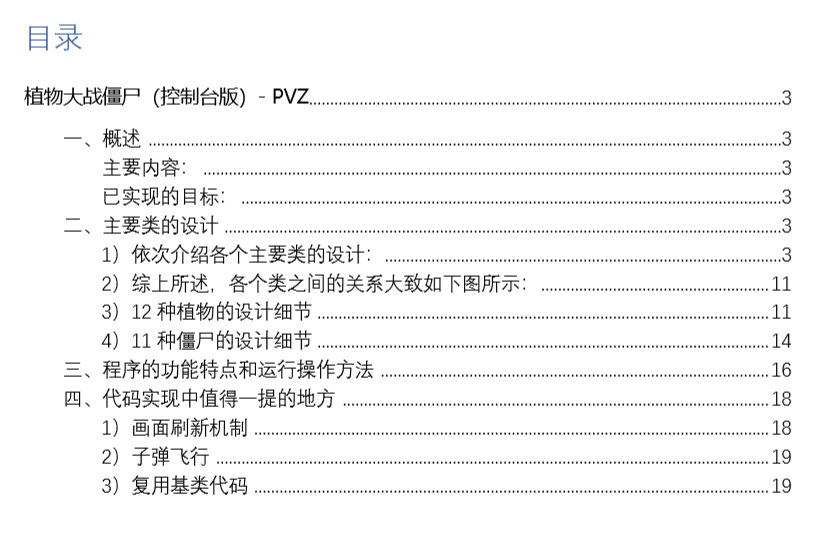

# PlantsVsZombies 
*——南京大学2019秋季学期 ”高级程序设计 “ 课程设计二*

基于C++控制台（Windows平台）的一个植物大战僵尸小游戏

**已实现的目标：**

- 12种植物：向日葵、豌豆射手、窝瓜、樱桃炸弹、坚果墙、寒冰射手、双发射手、大蒜、火爆辣椒、土豆地雷、地刺、高坚果墙。
- 11种僵尸：普通僵尸、摇旗僵尸、路障僵尸、铁桶僵尸、橄榄球僵尸、铁门僵尸、读报僵尸、撑杆僵尸、小丑僵尸、舞王僵尸、伴舞僵尸。
- 较好的UI效果：下方显示状态信息、帮助信息（随状态不同而展示不同的帮助信息）；爆炸、小丑、舞王等动作有一定的显示效果；植物名字分三类色块展示……
- 僵尸一波一波地刷新，且随着玩家得分增长，每次刷出的僵尸数量逐渐增加，难度渐进。
- 计分规则：击杀不同的僵尸可获得不同的分数；且游戏持续时间，也会使得分数增加（生存得分），1秒/分。

**可执行程序下载地址：**

https://github.com/NJU-TJL/PlantsVsZombies/releases

****

**Copyright © 2020 NJU-TJL**  

**[开放源代码许可](https://github.com/NJU-TJL/PlantsVsZombies/blob/master/LICENSE)**

**转载请注明原作者：https://github.com/NJU-TJL/PlantsVsZombies**

****

详情请见于：[课程设计报告](https://github.com/NJU-TJL/PlantsVsZombies/blob/master/Docs/%E8%AF%BE%E7%A8%8B%E8%AE%BE%E8%AE%A1%E6%8A%A5%E5%91%8A%20-%20%E6%A4%8D%E7%89%A9%E5%A4%A7%E6%88%98%E5%83%B5%E5%B0%B8.pdf)  

  

